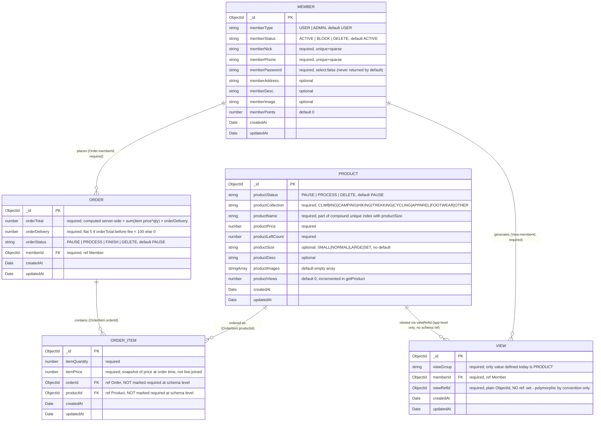

# Venturo ER Model & Storefront Gap Analysis

Scope: documents what's actually implemented in `src/schema/` + `src/models/*.service.ts` today, then proposes what the storefront (venturo-react) will need. No code was changed to produce this document — see [AGENTS.md](AGENTS.md) for repo rules and [VENTURO_AUDIT.md](VENTURO_AUDIT.md) for migration history.

---

## 1. Current State — ER Diagram

### Notes on relationships (from the service layer, not assumption)

- **Member → Order** (`Order.service.ts:createOrder/getMyOrders/updateOrder`): every order query is scoped by `memberId`, and `Order.memberId` is `required`. One member, zero-to-many orders.
- **Order → OrderItem** (`Order.service.ts:recordOrderItem`, `getMyOrders`'s `$lookup` on `localField: "_id", foreignField: "orderId"`): items are only ever created inside `createOrder`, one order to N items from a single request body array. **Not schema-enforced as required** — `orderId`/`productId` on `OrderItem` have `ref:` set but no `required: true`, so this relationship is only guaranteed by application code, not the database.
- **Product → OrderItem**: same caveat — `productId` has `ref: "Product"` but isn't required at the schema level. `getMyOrders` joins `orderItems.productId` against the `products` collection via `$lookup` to hydrate `productData`.
- **Member → View / "Product" → View**: `View.memberId` is a real, required Mongoose `ref`. `View.viewRefId`, however, is a **plain `ObjectId` with no `ref` at all** — it's only ever populated with a product `_id` today (`ProductService.getProduct`, hardcoded `viewGroup: ViewGroup.PRODUCT`), and `ViewGroup` currently has exactly one enum value (`PRODUCT`). The schema is shaped to be generic/polymorphic (any entity type keyed by `viewGroup`), but nothing in the codebase exercises that generality yet — treat `View` as "product view tracking" in practice, not a general-purpose activity log, until something else populates a second `viewGroup`.
- `itemPrice` on `OrderItem` is a **snapshot**, not a live reference — `Order.service.ts` takes `itemPrice`/`itemQuantity` straight from the client-submitted `OrderItemInput[]`, it does not re-read `Product.productPrice` server-side. (Flagged here because it's relevant to any "order track" or "price changed after purchase" design decision below, not something this task asks to fix.)

---

## 2. Gap Analysis

### Wishlist (member saving products)
**Verdict: needs a new entity.**

Nothing in the current schema supports "save for later." `View` looks superficially similar (`memberId` + a ref'd id) but its semantics don't fit: `ViewService` only has `checkViewExistance` (dedup check) and `insertMemberView` (insert-once) — **there is no delete/remove operation**, because a view-count is meant to be permanent history, not a togglable state. A wishlist needs add *and* remove. Reusing `View` would either require bolting delete support onto a model that's conceptually "immutable history," or overloading `viewGroup` to mean two different things (passive analytics vs. explicit user action) in the same collection.

Proposed: a small join collection, e.g. `Wishlist { memberId (ref Member, required), productId (ref Product, required), createdAt }`, with a compound unique index on `(memberId, productId)` so add-if-not-exists / remove is straightforward and duplicate saves are impossible at the DB level.

### Blog/Article content
**Verdict: needs a new entity — nothing exists today.**

There is no blog/article/content schema anywhere in this backend. Two open questions gate the exact shape (see Open Questions): authorship and taxonomy. Since the system is single-tenant (one `ADMIN` member per deployment, enforced in `MemberService.processSignup`), a full multi-author byline system is likely unnecessary — the "author" is implicitly the store. Recommend not adding an `authorId` ref unless multi-author is a real requirement; if it is needed for display purposes only, a plain string field is enough (no need to `ref` back to `Member`).

Proposed: `BlogPost { title, slug (unique), excerpt, body, coverImage, tags (string[]), status (DRAFT|PUBLISHED), publishedAt, createdAt, updatedAt }`. Start with a flat `tags: string[]` rather than a separate `BlogCategory` collection — a taxonomy entity is only worth the complexity if the design needs dedicated per-category landing pages beyond simple tag filtering.

### FAQ
**Verdict: does not need to be DB-backed for launch; this is a product decision, not a technical one.**

FAQ content is typically low-frequency-change, has no per-user variation, and needs no admin CRUD workflow evidenced anywhere in this repo (there is no `faq.ts` in *this* repository, so I can't inspect what "the old faq.ts" looked like — it's presumably in the frontend project). If FAQ answers must be editable by non-engineering staff without a deploy, it needs a minimal entity (`FAQItem { question, answer, order, category? }`). If not, keep it static in the frontend, same as before. No schema work needed unless that requirement is confirmed — see Open Questions.

### Contact Us
**Verdict: depends entirely on whether submissions need to persist — a product decision.**

Two valid designs:
1. **Fire-and-forget**: controller receives the form, sends an email (e.g. via nodemailer or a transactional email API), returns success. No schema, no new collection.
2. **Persisted inbox**: if the admin panel should show a list of contact submissions (mirroring how `users.ejs`/`products.ejs` already list things), needs `ContactMessage { name, email, phone?, subject?, message, status (NEW|READ|RESOLVED), createdAt }`.

Nothing in the current codebase indicates which is intended (no existing "inbox" pattern to extend, no email-sending dependency in `package.json` today either). Flagged in Open Questions.

### Order Track
**Verdict: existing schema partially covers it; needs additive fields, not a new entity.**

What's already there: `Order.orderStatus` (`PAUSE|PROCESS|FINISH|DELETE`) plus `createdAt`/`updatedAt`, and `getMyOrders` already returns each order joined with its `orderItems` and `productData`. That's enough for a basic "my orders" list and a coarse current-status badge.

What's missing for a real **tracking** page:
- **No delivery address snapshot.** `Order` has no address field at all — it only stores `memberId`. `Member.memberAddress` is mutable, so joining it live means an order's shown address could silently change after checkout if the member later edits their profile. A tracking/detail page showing "shipping to..." needs the address captured *at order time*.
- **No richer status granularity or timeline.** `OrderStatus` today has 4 coarse values, no per-stage timestamps (e.g. when it moved to PROCESS vs FINISH), and no carrier/tracking-number field. A tracking UI that shows a stepper (placed → processing → shipped → delivered) needs either more enum values, an embedded status-history array, or both.
- `itemPrice` is already snapshotted per `OrderItem` (see note in Section 1), so price-at-purchase display is already correct — no change needed there.

Proposed additive fields on `Order` (not a new entity): `orderAddress` (string or a small embedded snapshot of the address fields), optionally `trackingNumber`/`carrier`, and optionally a `statusHistory: [{ status, changedAt }]` subdocument array if a visual timeline is required. Exact status vocabulary is a product decision — see Open Questions.

---

## Proposed Additions

| Entity | New / Existing | Fields needed | Reasoning |
|---|---|---|---|
| **Home** | Existing | none | Can be built from `Product` (e.g. sort by `productViews` or `createdAt` for "popular"/"new arrivals") — no schema change. |
| **Shop List (PLP)** | Existing | none | `ProductService.getProducts` already supports collection filter, name search, sort, and pagination against fields already on `Product`. |
| **Shop Detail (PDP)** | Existing | none for core detail | `Product` already carries every field a detail page needs (name, price, images, desc, size, collection, stock, views). **Not covered**: ratings/reviews — no such entity exists; not part of the requested gap list, flagged in Open Questions rather than proposed here. |
| **My Account** | Existing | none | Profile via `MemberService.getMemberDetail`/`updateMember`, order history via `OrderService.getMyOrders` already cover a standard account page. A "Wishlist" tab depends on the new `Wishlist` entity below. |
| **Cart (dropdown/Basket)** | Existing | none | Cart is assembled client-side and posted as `OrderItemInput[]` to `/order/create`, matching the "no cart persistence, dropdown pattern" design already stated. No change needed unless a persisted/cross-device cart becomes a requirement later. |
| **Wishlist** | **New entity** | `memberId` (ref Member), `productId` (ref Product), `createdAt`; compound unique index on `(memberId, productId)` | Needs add **and** remove semantics that `View`'s insert-only model doesn't provide (see Gap Analysis). |
| **Order Track** | Existing, extend | Add to `Order`: address snapshot at order time; optionally `trackingNumber`/`carrier`; optionally `statusHistory` array if a timeline UI is needed | Current `orderStatus` + timestamps cover a basic status badge but not a full tracking experience — no address is captured today at all. |
| **Blog List / Blog Detail** | **New entity** | `BlogPost { title, slug, excerpt, body, coverImage, tags: string[], status, publishedAt, createdAt, updatedAt }` | No blog/content schema exists anywhere in this repo today. |
| **FAQ** | Conditional — new entity only if dynamic | `FAQItem { question, answer, order, category? }` (only if needed) | Product decision: static content has no technical requirement to be DB-backed. |
| **Contact Us** | Conditional — new entity only if persisted | `ContactMessage { name, email, phone?, subject?, message, status, createdAt }` (only if needed) | Product decision: depends on whether submissions need an admin-reviewable inbox or are just emailed out. |

---

## Open Questions

Product decisions, not technical ones — needed before any of the conditional items above are implemented:

1. **FAQ**: Does an FAQ entry ever need to be added/edited by non-engineering staff without a code deploy? If yes → needs `FAQItem`. If no → stays static in the frontend, no backend work at all.
2. **Contact Us**: Should submitted messages be visible/manageable in the admin panel (an "inbox," matching the existing `users.ejs`/`products.ejs` list-and-manage pattern), or is a simple outbound email on submit sufficient? This also determines whether a mail-sending dependency needs to be added to `package.json`.
3. **Blog authorship**: Given the system is single-tenant (one `ADMIN` account), does the storefront actually need a visible "written by X" byline with multiple possible authors, or is a single implicit store byline acceptable? Determines whether `BlogPost` needs an `authorId` ref at all.
4. **Blog taxonomy**: Is flat `tags: string[]` sufficient, or does the design call for dedicated category landing pages (which would justify a separate `BlogCategory` entity instead of/alongside tags)?
5. **Order Track granularity**: What exact status vocabulary and timeline does the Order Track page need? This determines whether `OrderStatus` just needs more enum values, or whether a full `statusHistory` subdocument array (with per-stage timestamps) is required.
6. **Order address capture**: Should the order snapshot the member's full address as a single string, or as structured fields (street/city/postal/etc.)? Affects whether this is one new field or several.
7. **Wishlist placement**: Is a separate `Wishlist` collection the right shape, or would an embedded array of `productId`s directly on `Member` be preferred? A separate collection was proposed here because it naturally supports "date added," pagination, and doesn't bloat the `Member` document, but this is a reasonable design choice to revisit.
8. **PDP reviews/ratings**: Not part of the requested gap list, but a common Shop Detail feature with no existing schema support at all. Worth confirming explicitly whether this is in scope for the storefront's first version or a later phase — flagging so it isn't accidentally assumed out-of-scope by omission.
9. **Stock/availability display**: `Product.productLeftCount` already exists and is populated, but nothing today surfaces "out of stock" behavior in any UI. Confirm whether Shop List/Detail should hide, disable, or badge zero-stock items — this is a UI/product decision, not a schema gap.
